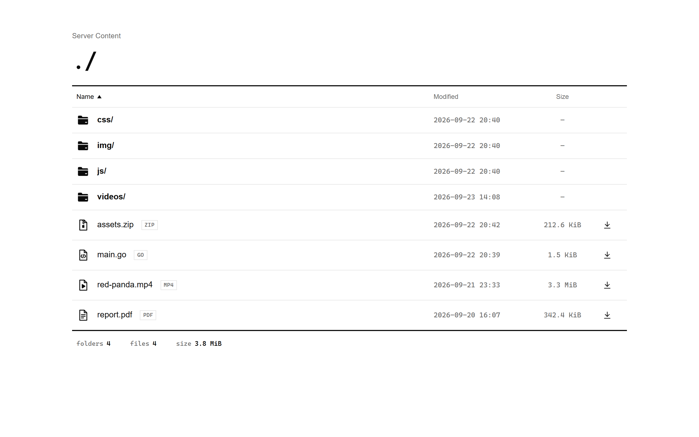
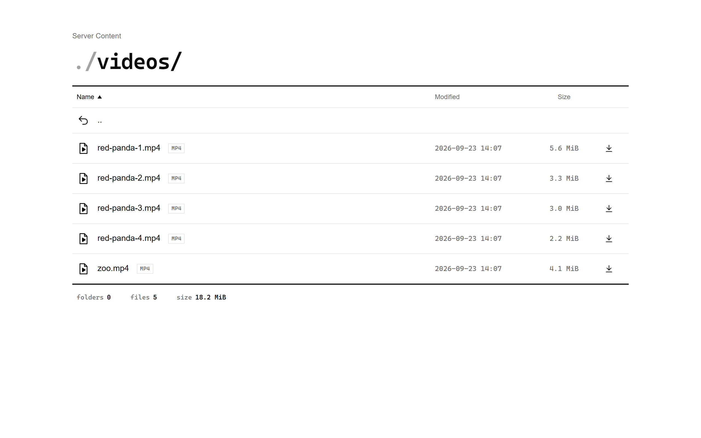

# prettyfs

A styled alternative to Go's `http.FileServer`.




## Features

- Clean, minimal directory listing with file-type icons and sorting by name, date or size
- Download any file or a whole folder as `.zip` (streamed, with size limits)
- Range requests, conditional requests and resumable downloads (via `http.ServeContent`)
- Private folders: drop a `.private` file inside and the folder disappears, subfolders included
- Path traversal protection; symlinks can't escape into private folders
- Per-IP and server-wide rate limits for browsing and downloads
- HTML pages for browsers, plain-text errors for `curl` and scripts
- No external dependencies except `golang.org/x/time/rate`

## Install

```bash
go get github.com/happydez/prettyfs
```

## Quick start

```go
package main

import (
	"log"
	"net/http"
	"os"

	pretty "github.com/happydez/prettyfs"
)

func main() {
	root, err := os.OpenRoot("./files/static")
	if err != nil {
		log.Fatal(err)
	}
	defer root.Close()

	mux := http.NewServeMux()
	mux.Handle("GET /static/", http.StripPrefix("/static", pretty.FileServer(root.FS(),
		pretty.WithTitle("Server Content"),
		pretty.WithMaxEntries(1000),
		pretty.WithZip(true),
		pretty.WithZipLimit(1<<30, 20000),
		pretty.WithDownloadRateLimit(10, 1*time.Minute),
	)))

	log.Fatal(http.ListenAndServe(":8080", mux))
}
```

## Options

| Option | Default | Description |
|---|---|---|
| `WithTitle(string)` | `"Files"` | Title shown above the path |
| `WithFavicon(string)` | inline `fs` icon | Favicon URL or `data:` URI; `""` removes it |
| `WithMaxEntries(n)` | `10000` | Max rows in a listing; `0` = no limit |
| `WithPrivateMarker(name)` | `".private"` | Marker file that hides a folder; `""` disables |
| `WithHiddenFiles(bool)` | `false` | Show and serve dotfiles (`.env`, `.git`) |
| `WithSymlinks(bool)` | `false` | Follow symlinks inside the root |
| `WithIndexHTML(bool)` | `true` | Serve `index.html` instead of a listing |
| `WithSandbox(bool)` | `true` | Serve HTML/SVG/XML with `CSP: sandbox` |
| `WithZip(bool)` | `true` | Allow folder downloads as `.zip`; passing it outranks `WithDownload` |
| `WithDownload(bool)` | `true` | Allow file downloads; `false` serves only what a browser displays |
| `WithBlockedExtensions(...)` | none | Refuse these extensions; everything else is served |
| `WithZipLimit(bytes, files)` | `1 GiB`, `10000` | Max zip size and entry count; `0` = no limit |
| `WithMaxConcurrentZips(n)` | `4` | Zips built at once; `0` = no limit |
| `WithCacheControl(string)` | `"no-cache"` | `Cache-Control` for files; `""` omits it |
| `WithRateLimit(n, per)` | off | All requests per IP |
| `WithDownloadRateLimit(n, per)` | off | Distinct files and zips per IP |
| `WithDownloadRequestRateLimit(n, per)` | off | Download requests per IP, repeats included |
| `WithGlobalRateLimit(n, per)` | off | All requests, server-wide |
| `WithGlobalDownloadRateLimit(n, per)` | off | Downloads, server-wide |
| `WithGlobalLimiter(Limiter)` | - | Custom server-wide request limiter |
| `WithGlobalDownloadLimiter(Limiter)` | - | Custom server-wide download limiter |
| `WithTrustedProxy(hops)` | off | Read client IP from `X-Forwarded-For` |
| `WithLogger(*slog.Logger)` | `slog.Default()` | Error logger |

## Private folders

```
static/
├── public/
│   └── photo.jpg
└── internal/
    ├── .private    <─── empty marker file
    └── report.pdf
```

`/static/internal/` and everything inside it return `404`. The folder is hidden from
listings and skipped in zip archives. The check covers every parent folder, so
nested folders are private too.

## Restricting downloads

`WithDownload(false)` is a policy for a file browser: serve what a browser renders
text, images, audio, video, docs and refuse everything that would land on disk. It
guesses from the content type, so an asset a page needs (a font, a wasm module) is
refused too. Folder archives go off with it, since a zip would carry the very files
the policy refuses unless `WithZip` is passed explicitly, which then decides:

```go
pretty.WithDownload(false),   // single files: only what a browser displays
pretty.WithZip(true),         // whole folders: still downloadable
```

`WithBlockedExtensions(".zip", ".exe")` names the types instead of guessing. Listed
extensions return `403` and never enter a folder archive; everything else is served
the way `http.FileServer` would. Case and a leading dot do not matter.

## Rate limiting

Per-IP limits use a sliding window: `WithDownloadRateLimit(20, time.Minute)` means at
most 20 in any 60 seconds, not 20 per calendar minute. `WithGlobalRateLimit` is a token
bucket instead. It allows a burst of `n` and then refills one slot every `per/n`.

Download limits cover what actually lands on the client's disk: `?download=1`, `?zip=1`,
and any file the browser cannot display and therefore saves an archive, an installer,
a binary. Opening a page, an image, a video or a PDF is an ordinary request and belongs
to `WithRateLimit`.

`WithDownloadRateLimit` counts **files, not requests**. Repeated downloads of the same
file count once.

`WithDownloadRequestRateLimit` counts **every request**, so downloading one file ten
times costs ten and a chunked download costs one hit per chunk. The two options set
the same limiter, so pass only one.

IPv6 clients are grouped by `/64`. Blocked clients get `429 Too Many Requests` with a
`Retry-After` header.

Built-in limits live in process memory. For several instances behind a load balancer,
plug in a shared implementation of `pretty.Limiter` (for example, Redis-backed) with
`WithGlobalLimiter`.

## Security notes

- Pass `os.Root.FS()`, not `os.DirFS`: it guarantees nothing outside the root is reachable.
- Use `WithTrustedProxy` only when clients can't reach the server directly,
  otherwise they can spoof `X-Forwarded-For`.
- `WithSandbox(true)` blocks JavaScript in served HTML. Disable it only for content you trust.

## License

MIT